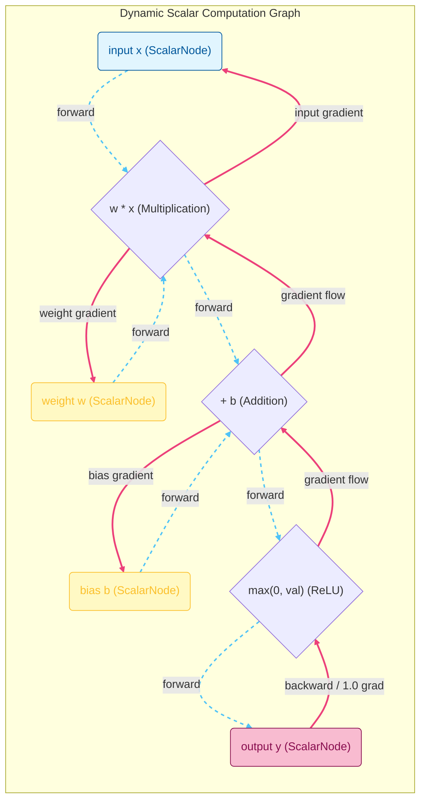

# lmgnu
The `lmgnu` repository implements a programmatic framework for executing multi-dimensional automatic differentiation ($\text{Autograd}$) and training feedforward neural topologies natively without external runtime library dependencies. The repository achieves this through two highly integrated layers:
1. **The Primal Scalar Engine (`ScalarNode`)**: At the foundational layer, every mathematical primitive is encapsulated within a custom node object that tracks its own forward-pass evaluation value ($x$) and its analytical partial derivative ($\frac{\partial \mathcal{L}}{\partial x}$).
2. **The Tensor Multi-Dimensional Grid (`Tensor`)**: Higher-level operations scale these scalar entities into structured 2D matrices, providing clean abstractions for linear transformations, broadcasted additions, and matrix multiplication ($\text{MatMul}$) while inherently preserving backpropagation hooks across the underlying grid coordinates.

### 1. Dynamic Graph Construction (The Computational Tape)
When expressions are executed forward, operations between `ScalarNode` or `Tensor` objects dynamically build an acyclic directed graph ($\text{DAG}$). Each operation instantiates a new node containing explicit pointers (`_parents`) to the precise variables that formed it, along with a localized derivative evaluation closure (`_backprop`). 

This mechanism acts as a live computational tape, tracking the complete operational lineage of the network's variables in real-time.

[Leaf Node: Weight] ----
+---> [Operation Node: Mul] ---> [Output Node]
[Leaf Node: Input]  -

### 2. Reverse-Mode Automatic Differentiation
Backpropagation is initiated by calling the `.backward()` method on a terminal objective node (typically a calculated scalar loss value). The execution engine triggers a depth-first search ($\text{DFS}$) across the operational graph to resolve a valid topological sort. 

Traversing this sorted sequence in exact reverse order ensures that no node evaluates its structural derivatives until all dependent parent nodes have successfully distributed their downstream signals. The library applies the calculus chain rule sequentially, accumulating gradients cleanly across nodes to support deep model configurations:

$$\frac{\partial \mathcal{L}}{\partial x_{\text{parent}}} = \frac{\partial \mathcal{L}}{\partial y_{\text{child}}} \cdot \frac{\partial y_{\text{child}}}{\partial x_{\text{parent}}}$$

### 3. Native Deep Learning and Mathematical Pipelines
* **Dense Layer Linear Algebra**: Network layers translate standard feedforward equations ($Y = XW + b$) by mapping discrete vector elements straight to the underlying scalar tape, natively handling multi-sample batch rows through automated matrix loops.
* **Non-Linear Activations**: Element-wise activation functions ($\text{ReLU}$, $\text{Sigmoid}$, $\text{Tanh}$, $\text{Exp}$) are calculated directly, injecting precise local activation thresholds and mathematical derivatives seamlessly into the global gradient flow.
* **Scratch Logarithmic Expansion**: The isolated `logarithm` module bypasses standard floating-point approximation shortcuts. Instead, it relies on an internal range reduction loop utilizing the constant $E$ to scale parameters down to a tight convergence frame ($[0.5, 1.5]$) before performing a high-precision inverse hyperbolic tangent Taylor series expansion to determine natural log values.

## Module Reference: `lmgnu.nn`

### class ScalarNode
`ScalarNode(val, parents=(), operation='')`

Tracks numerical primitives, operations, and analytical gradients inside the computational tape.

#### Attributes
* **data** (*float*): The primal forward value computed in the forward pass.
* **grad** (*float*): The reverse accumulated partial derivative ($\frac{\partial \mathcal{L}}{\partial x}$) initialized at `0.0`.

#### Mathematical Operations & Methods

* **`__add__(secondary)`**
  * **Forward Pass**: $f(x, y) = x + y$
  * **Backward Component**: $\frac{\partial f}{\partial x} = 1.0$, $\frac{\partial f}{\partial y} = 1.0$
* **`__mul__(secondary)`**
  * **Forward Pass**: $f(x, y) = x \cdot y$
  * **Backward Component**: $\frac{\partial f}{\partial x} = y$, $\frac{\partial f}{\partial y} = x$
* **`__pow__(exponent)`**
  * **Forward Pass**: $f(x) = x^k$ (where $k$ is an un-tracked integer or float exponent)
  * **Backward Component**: $\frac{\partial f}{\partial x} = k \cdot x^{k-1}$
* **`relu()`**
  * **Forward Pass**: 
    $$f(x) = \begin{cases} x & \text{if } x > 0 \\ 0 & \text{otherwise} \end{cases}$$
  * **Backward Component**: 
    $$\frac{\partial f}{\partial x} = \begin{cases} 1.0 & \text{if } x > 0 \\ 0.0 & \text{otherwise} \end{cases}$$
* **`exp()`**
  * **Forward Pass**: $f(x) = e^x$ (Stably clipped to a hard threshold domain of $[-500, 500]$ to block floating-point overflow)
  * **Backward Component**: $\frac{\partial f}{\partial x} = e^x$
* **`sigmoid()`**
  * **Forward Pass**: $f(x) = \frac{1}{1 + e^{-x}}$
  * **Backward Component**: $\frac{\partial f}{\partial x} = f(x) \cdot (1.0 - f(x))$
* **`tanh()`**
  * **Forward Pass**: $f(x) = \frac{e^x - e^{-x}}{e^x + e^{-x}}$
  * **Backward Component**: $\frac{\partial f}{\partial x} = 1.0 - f(x)^2$
* **`backward()`**
  * Executes a dynamic topological sort via a depth-first search strategy across all linked variables in the computational graph. Traverses the ordered sequence in reverse, calling internal analytical step closures to distribute accumulated gradients down to leaf parameters via the chain rule.

---

### class Tensor
`Tensor(data)`

Wraps matrices of `ScalarNode` elements for higher-level algebraic operations.

#### Attributes
* **shape** (*tuple*): Dimensions of the array represented as `(rows, columns)`.
* **data** (*list*): Inner grid containing rows of explicit `ScalarNode` pointers.

#### Matrix Operations & Methods
* **`__add__(other)`**
  * Calculates element-wise addition or handles implicit row-bias broadcasting.
  * **Constraints**: Requires matching shapes $\mathcal{A}_{(M \times N)} + \mathcal{B}_{(M \times N)}$ or a row matrix $\mathcal{B}_{(1 \times N)}$.
* **`matmul(other)`**
  * Executes dense linear matrix dot products.
  * **Constraints**: Input configurations must adhere to standard matrix multiplication rules: $(M \times N) 	imes (N 	imes P) 
ightarrow (M 	imes P)$.
* **`relu()`**
  * Element-wise vector execution mapping the scalar `.relu()` function to every internal coordinate.
* **`backward()`**
  * Iterates globally across the structural data grid and triggers a `.backward()` call on each individual coordinate.
* **`get_data()`**
  * Extracts forward data from the internal nodes.
  * **Returns**: A nested list of standard Python floats.
* **`get_grads()`**
  * Extracts backward analytical gradients from the internal nodes.
  * **Returns**: A nested list of standard Python floats.

---

### class SequentialNetwork
`SequentialNetwork(inputs_count, layers_shapes)`

Assembles independent `DenseLayer` structures containing `LinearUnit` processing modules into a feedforward Multi-Layer Perceptron (MLP) pipeline.

#### Operational Methods
* **`__call__(x)`**
  * Processes input variables through the sequential multi-layer topology. Automatically handles structural differences if passed an instantiated `Tensor` object vs a basic Python iterable array.
* **`reset_gradients()`**
  * Loops through all internal parameters and resets their values (`.grad = 0.0`).
* **`get_parameters()`**
  * Flattens and extracts references to every active tracking weight and bias `ScalarNode` across the underlying layers.
  * **Returns**: A flat list of `ScalarNode` pointers.

---

## Module Reference: `lmgnu.logarithm`

### def ln
`ln(x)`

Evaluates the natural logarithm ($\ln(x)$) of a positive scalar value using fixed iterative structures without external library calls.

* **Domain Bounds**: Enforces $x > 0$. Violations prompt standard `ValueError` exceptions. Complex domain evaluation is unsupported.
* **Algorithm Pipeline**:
  1. **Range Reduction Phase**: Applies a scaling loop dividing or multiplying $x$ by the constant $E$ ($2.7182818284590452354$) to push the value into a narrow target convergence range $[0.5, 1.5]$, maintaining an explicit trace counter (`exponent_shift`).
  2. **Taylor Series Expansion**: Evaluates the localized reduction using an inverse hyperbolic tangent mapping to avoid analytical slow-downs:
   
  $$y = \frac{x - 1}{x + 1}$$
  $$\ln(x) = \text{exponent shift} + 2.0 \cdot \sum_{n=0}^{\infty} \frac{y^{2n+1}}{2n + 1}$$
* **Termination Criteria**: The series execution halts programmatically when a term yields a value smaller than $10^{-16}$ or hits a maximum boundary condition of $1000$ iterations.

---

## Limitations and Core Constraints

* **Computational Overhead**: Tensors are implemented as nested Python lists wrapping individual `ScalarNode` pointers. The implementation lacks contiguous memory pooling, vectorization (SIMD), or GPU acceleration. Scale operations accordingly.
* **Memory Leaks via Reference Cycles**: The reverse-mode graph retains explicit `_parents` references. The graph remains allocated in memory until explicitly out-of-scope or manually garbage collected.
* **Logarithm Domain**: `lmgnu.logarithm.ln(x)` evaluates real numeric floating points where $x > 0$. Complex domain evaluation is unsupported.
* **Broadcast Constraints**: The `Tensor.__add__` module solely supports strict dimension matching or 1-row bias row broadcasting. General multi-axis broadcasting is disabled.

